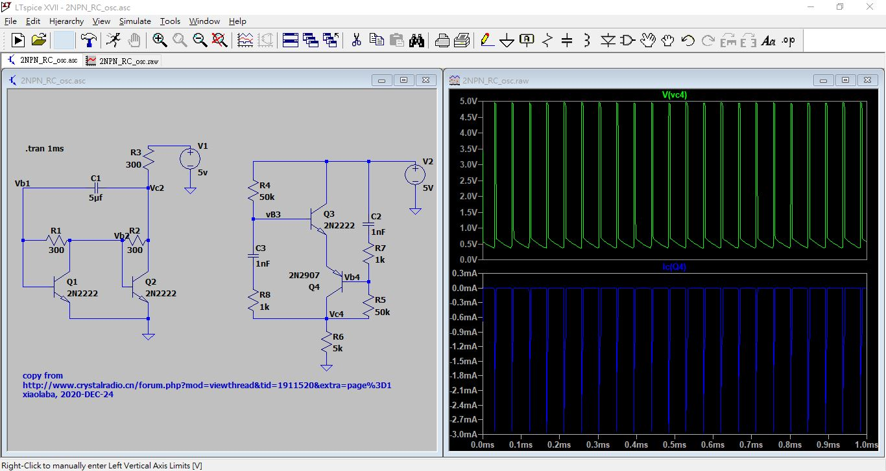

# LTspice-2-NPN-PNP-RC-oscillator
source code of osc circuit simulaiton



source code file, 
[2NPN_RC_osc.asc](2NPN_RC_osc.asc)


source code, text,
```
Version 4
SHEET 1 1592 680
WIRE 496 -144 368 -144
WIRE 912 -96 688 -96
WIRE 1040 -96 912 -96
WIRE 1184 -96 1040 -96
WIRE 688 -48 688 -96
WIRE 176 -16 -16 -16
WIRE 368 -16 368 -64
WIRE 368 -16 240 -16
WIRE 496 -16 496 -64
WIRE 912 32 912 -96
WIRE 1184 48 1184 -16
WIRE 1040 64 1040 -96
WIRE 688 80 688 32
WIRE 752 80 688 80
WIRE 848 80 752 80
WIRE -16 144 -16 -16
WIRE 48 144 -16 144
WIRE 288 144 128 144
WIRE 368 144 368 -16
WIRE 1040 144 1040 128
WIRE 688 160 688 80
WIRE 912 224 912 128
WIRE 128 240 128 144
WIRE 368 240 368 144
WIRE 992 272 976 272
WIRE 1040 272 1040 224
WIRE 1040 272 992 272
WIRE -16 288 -16 144
WIRE 64 288 -16 288
WIRE 288 288 288 144
WIRE 304 288 288 288
WIRE 688 288 688 224
WIRE 1040 304 1040 272
WIRE 128 384 128 336
WIRE 368 384 368 336
WIRE 368 384 128 384
WIRE 688 384 688 368
WIRE 912 384 912 320
WIRE 912 384 688 384
WIRE 944 384 912 384
WIRE 1040 384 944 384
WIRE 912 416 912 384
WIRE 368 432 368 384
WIRE 912 528 912 496
FLAG 368 432 0
FLAG 496 -16 0
FLAG -16 -16 Vb1
FLAG 368 -16 Vc2
FLAG 288 144 Vb2
FLAG 1184 48 0
FLAG 912 528 0
FLAG 752 80 vB3
FLAG 992 272 Vb4
FLAG 944 384 Vc4
SYMBOL res 144 128 R90
WINDOW 0 0 56 VBottom 2
WINDOW 3 32 56 VTop 2
SYMATTR InstName R1
SYMATTR Value 300
SYMBOL res 384 128 R90
WINDOW 0 0 56 VBottom 2
WINDOW 3 32 56 VTop 2
SYMATTR InstName R2
SYMATTR Value 300
SYMBOL npn 64 240 R0
SYMATTR InstName Q1
SYMATTR Value 2N2222
SYMBOL npn 304 240 R0
SYMATTR InstName Q2
SYMATTR Value 2N2222
SYMBOL cap 240 -32 R90
WINDOW 0 0 32 VBottom 2
WINDOW 3 32 32 VTop 2
SYMATTR InstName C1
SYMATTR Value 5番
SYMBOL res 384 -48 R180
WINDOW 0 36 76 Left 2
WINDOW 3 36 40 Left 2
SYMATTR InstName R3
SYMATTR Value 300
SYMBOL voltage 496 -160 R0
SYMATTR InstName V1
SYMATTR Value 5v
SYMBOL voltage 1184 -112 R0
WINDOW 123 0 0 Left 0
WINDOW 39 0 0 Left 0
SYMATTR InstName V2
SYMATTR Value 5V
SYMBOL npn 848 32 R0
SYMATTR InstName Q3
SYMATTR Value 2N2222
SYMBOL pnp 976 320 R180
SYMATTR InstName Q4
SYMATTR Value 2N2907
SYMBOL res 672 -64 R0
SYMATTR InstName R4
SYMATTR Value 50k
SYMBOL res 896 400 R0
SYMATTR InstName R6
SYMATTR Value 5k
SYMBOL cap 1024 64 R0
SYMATTR InstName C2
SYMATTR Value 1nF
SYMBOL cap 672 160 R0
SYMATTR InstName C3
SYMATTR Value 1nF
SYMBOL res 1024 288 R0
SYMATTR InstName R5
SYMATTR Value 50k
SYMBOL res 1024 128 R0
SYMATTR InstName R7
SYMATTR Value 1k
SYMBOL res 672 272 R0
SYMATTR InstName R8
SYMATTR Value 1k
TEXT -8 -136 Left 2 !.tran 1ms
TEXT -16 560 Left 2 ;copy from\nhttp://www.crystalradio.cn/forum.php?mod=viewthread&tid=1911520&extra=page%3D1\nxiaolaba, 2020-DEC-24

```
